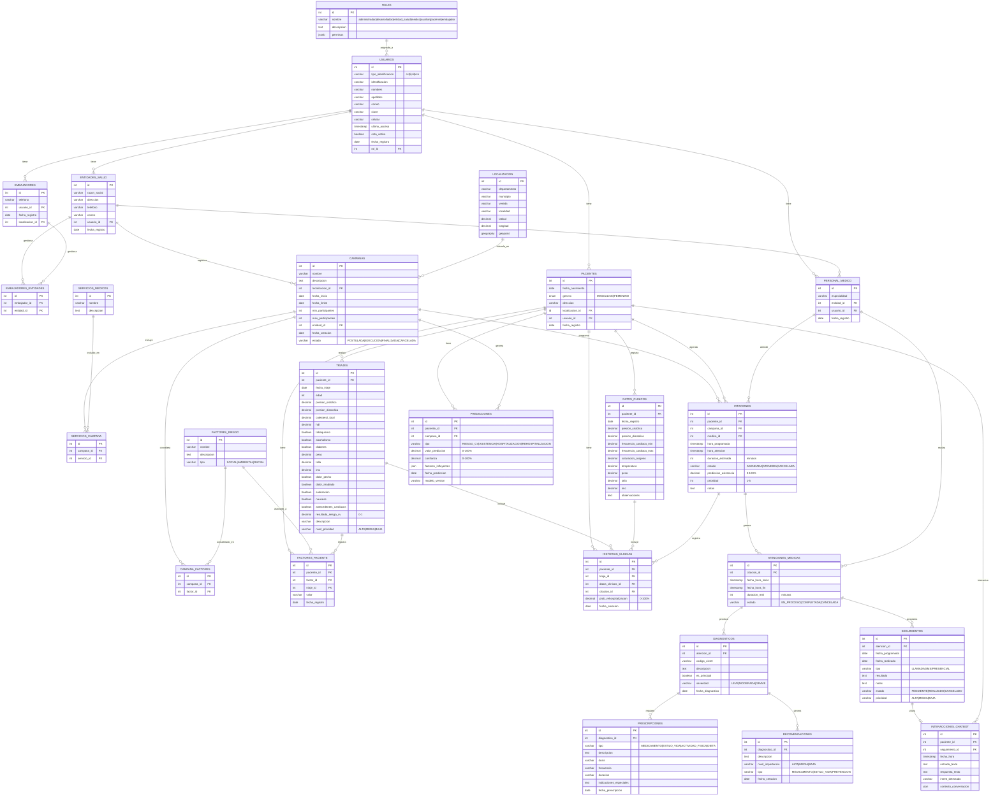

```mermaid
erDiagram
    USUARIOS {
        int id PK
        varchar tipo_identificacion "cc|ti|nit|rcn"
        varchar identificacion
        varchar nombres
        varchar apellidos
        varchar correo
        varchar clave
        varchar celular
        timestamp ultimo_acceso
        boolean esta_activo
        date fecha_registro
        int rol_id FK
    }

    ROLES {
        int id PK
        varchar nombre "administrador|desarrollador|entidad_salud|medico|auxiliar|paciente|embajador"
        text descripcion
        jsonb permisos
    }

    ENTIDADES_SALUD {
        int id PK
        varchar razon_social
        varchar direccion
        varchar telefono
        varchar correo
        int usuario_id FK
        date fecha_registro
    }

    EMBAJADORES {
        int id PK
        varchar telefono
        int usuario_id FK
        date fecha_registro
        int localizacion_id FK
    }

    EMBAJADORES_ENTIDADES {
        int id PK
        int embajador_id FK
        int entidad_id FK
    }

    PERSONAL_MEDICO {
        int id PK
        varchar especialidad
        int entidad_id FK
        int usuario_id FK
        date fecha_registro
    }

    PACIENTES {
        int id PK
        date fecha_nacimiento
        enum genero "MASCULINO|FEMENINO"
        varchar direccion
        id localizacion_id FK
        int usuario_id FK
        date fecha_registro
    }

    LOCALIZACION {
        int id PK
        varchar departamento
        varchar municipio
        varchar vereda
        varchar localidad
        decimal latitud
        decimal longitud
        geography geopoint
    }

    CAMPANAS {
        int id PK
        varchar nombre
        text descripcion
        int localizacion_id FK
        date fecha_inicio
        date fecha_limite
        int min_participantes
        int max_participantes
        int entidad_id FK
        date fecha_creacion
        varchar estado "POSTULADA|EJECUCION|FINALIZADA|CANCELADA"
    }

    SERVICIOS_MEDICOS {
        int id PK
        varchar nombre
        text descripcion
    }

    SERVICIOS_CAMPANA {
        int id PK
        int campana_id FK
        int servicio_id FK
    }

    FACTORES_RIESGO {
        int id PK
        varchar nombre
        text descripcion
        varchar tipo "SOCIAL|AMBIENTAL|RACIAL"
    }

    CAMPANA_FACTORES {
        int id PK
        int campana_id FK
        int factor_id FK
    }

    TRIAJES {
        int id PK
        int paciente_id FK
        date fecha_triaje
        int edad
        decimal presion_sistolica
        decimal presion_diastolica
        decimal colesterol_total
        decimal hdl
        boolean tabaquismo
        boolean alcoholismo
        boolean diabetes
        decimal peso
        decimal talla
        decimal imc
        boolean dolor_pecho
        boolean dolor_irradiado
        boolean sudoracion
        boolean nauseas
        boolean antecedentes_cardiacos
        decimal resultado_riesgo_cv "0-1"
        varchar descripcion
        varchar nivel_prioridad "ALTA|MEDIA|BAJA"
    }

    DATOS_CLINICOS {
        int id PK
        int paciente_id FK
        date fecha_registro
        decimal presion_sistolica
        decimal presion_diastolica
        decimal frecuencia_cardiaca_min
        decimal frecuencia_cardiaca_max
        decimal saturacion_oxigeno
        decimal temperatura
        decimal peso
        decimal talla
        decimal imc
        text observaciones
    }

    FACTORES_PACIENTE {
        int id PK
        int paciente_id FK
        int factor_id FK
        int triaje_id FK
        varchar valor
        date fecha_registro
    }

    CITACIONES {
        int id PK
        int paciente_id FK
        int campana_id FK
        int medico_id FK
        timestamp hora_programada
        timestamp hora_atencion
        int duracion_estimada "minutos"
        varchar estado "AGENDADA|ATENDIDA|CANCELADA"
        decimal prediccion_asistencia "0-100%"
        int prioridad "1-5"
        text notas
    }

    HISTORIAS_CLINICAS {
        int id PK
        int paciente_id FK
        int triaje_id FK
        int datos_clinicos_id FK
        int citacion_id FK
        decimal prob_rehospitalizacion "0-100%"
        date fecha_creacion
    }

    ATENCIONES_MEDICAS {
        int id PK
        int citacion_id FK
        timestamp fecha_hora_inicio
        timestamp fecha_hora_fin
        int duracion_real "minutos"
        varchar estado "EN_PROCESO|COMPLETADA|CANCELADA"
    }

    DIAGNOSTICOS {
        int id PK
        int atencion_id FK
        varchar codigo_cie10
        text descripcion
        boolean es_principal
        varchar severidad "LEVE|MODERADA|GRAVE"
        date fecha_diagnostico
    }

    PRESCRIPCIONES {
        int id PK
        int diagnostico_id FK
        varchar tipo "MEDICAMENTO|ESTILO_VIDA|ACTIVIDAD_FISICA|DIETA"
        text descripcion
        varchar dosis
        varchar frecuencia
        varchar duracion
        text indicaciones_especiales
        date fecha_prescripcion
    }

    SEGUIMIENTOS {
        int id PK
        int atencion_id FK
        date fecha_programada
        date fecha_realizada
        varchar tipo "LLAMADA|SMS|PRESENCIAL"
        text resultado
        text notas
        varchar estado "PENDIENTE|REALIZADO|CANCELADO"
        varchar prioridad "ALTA|MEDIA|BAJA"
    }

    PREDICCIONES {
        int id PK
        int paciente_id FK
        int campana_id FK
        varchar tipo "RIESGO_CV|ASISTENCIA|HOSPITALIZACION|REHOSPITALIZACION"
        decimal valor_prediccion "0-100%"
        decimal confianza "0-100%"
        json factores_influyentes
        date fecha_prediccion
        varchar modelo_version
    }

    INTERACCIONES_CHATBOT {
        int id PK
        int paciente_id FK
        int seguimiento_id FK
        timestamp fecha_hora
        text entrada_texto
        text respuesta_texto
        varchar intent_detectado
        json contexto_conversacion
    }

    RECOMENDACIONES {
        int id PK
        int diagnostico_id FK
        text descripcion
        varchar nivel_importancia "ALTA|MEDIA|BAJA"
        varchar tipo "MEDICAMENTO|ESTILO_VIDA|PREVENCION"
        date fecha_creacion
    }

    USUARIOS ||--o{ ENTIDADES_SALUD : tiene
    USUARIOS ||--o{ EMBAJADORES : tiene
    USUARIOS ||--o{ PERSONAL_MEDICO : tiene
    USUARIOS ||--o{ PACIENTES : tiene
    ROLES ||--o{ USUARIOS : asignado_a

    ENTIDADES_SALUD ||--o{ CAMPANAS : organiza
    ENTIDADES_SALUD ||--o{ EMBAJADORES_ENTIDADES : gestiona
    EMBAJADORES ||--o{ EMBAJADORES_ENTIDADES : gestiona
    ENTIDADES_SALUD ||--o{ PERSONAL_MEDICO : emplea

    LOCALIZACION ||--o{ CAMPANAS : ubicada_en

    CAMPANAS ||--o{ SERVICIOS_CAMPANA : incluye
    SERVICIOS_MEDICOS ||--o{ SERVICIOS_CAMPANA : incluido_en

    CAMPANAS ||--o{ CAMPANA_FACTORES : considera
    FACTORES_RIESGO ||--o{ CAMPANA_FACTORES : considerado_en

    PACIENTES ||--o{ TRIAJES : realiza
    PACIENTES ||--o{ FACTORES_PACIENTE : tiene
    FACTORES_RIESGO ||--o{ FACTORES_PACIENTE : asociado_a
    TRIAJES ||--o{ FACTORES_PACIENTE : registra

    CAMPANAS ||--o{ CITACIONES : programa
    PACIENTES ||--o{ CITACIONES : agenda
    PERSONAL_MEDICO ||--o{ CITACIONES : atiende

    PACIENTES ||--o{ DATOS_CLINICOS : registra

    PACIENTES ||--o{ HISTORIAS_CLINICAS : tiene
    TRIAJES ||--o{ HISTORIAS_CLINICAS : incluye
    DATOS_CLINICOS ||--o{ HISTORIAS_CLINICAS : incluye
    CITACIONES ||--o{ HISTORIAS_CLINICAS : registra

    CITACIONES ||--o{ ATENCIONES_MEDICAS : genera
    PERSONAL_MEDICO ||--o{ ATENCIONES_MEDICAS : realiza

    ATENCIONES_MEDICAS ||--o{ DIAGNOSTICOS : produce
    DIAGNOSTICOS ||--o{ PRESCRIPCIONES : requiere
    DIAGNOSTICOS ||--o{ RECOMENDACIONES : genera

    ATENCIONES_MEDICAS ||--o{ SEGUIMIENTOS : programa
    SEGUIMIENTOS ||--o| INTERACCIONES_CHATBOT : utiliza

    PACIENTES ||--o{ PREDICCIONES : tiene
    CAMPANAS ||--o{ PREDICCIONES : genera
    PACIENTES ||--o{ INTERACCIONES_CHATBOT : interactua
```